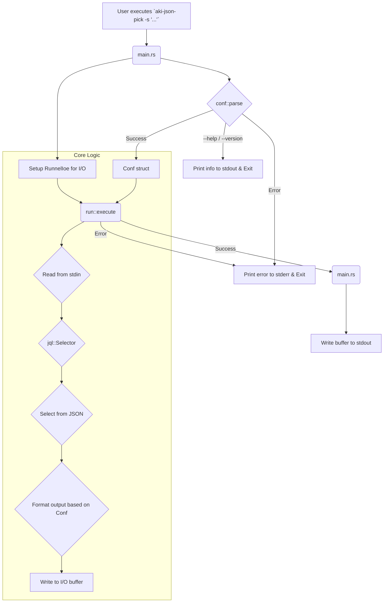

'''# Design for `aki-json-pick`

This document outlines the software design for the `aki-json-pick` command-line utility. The design is derived from the acceptance criteria and the existing source code structure.

## 1. High-Level Architecture

`aki-json-pick` is a standard Unix-style command-line tool that follows the "filters" pattern. It reads data from standard input, transforms it, and writes the result to standard output. Errors and informational messages are directed to standard error.

The project is structured into a Rust library (`libaki_json_pick`) and a binary executable (`aki-json-pick`). This separation allows the core logic to be potentially reused by other programs and facilitates testing.

The overall workflow is as follows:
1.  The binary's `main` function starts.
2.  Command-line arguments are parsed into a `Conf` struct.
3.  The core `execute` function is called with the configuration.
4.  `execute` reads from `stdin`, applies the JSON selection logic, and writes to an in-memory buffer.
5.  The `main` function writes the buffer's contents to `stdout`.
6.  Errors at any stage are propagated, printed to `stderr`, and result in a non-zero exit code.

## 2. Component Breakdown

The application logic is divided into several modules within the `src` directory.

### `main.rs`
-   **Purpose:** The entry point for the executable.
-   **Responsibilities:**
    -   Collect command-line arguments from `std::env`.
    -   Invoke the configuration parser (`conf::parse::parse`).
    -   Handle the results of the parser:
        -   On success, proceed to call the core logic.
        -   On `Help` or `Version` "errors", exit gracefully (status 0).
        -   On actual errors, print the error to `stderr` and exit with status 1.
    -   Set up the I/O handler (`RunnelIoe`) for `stdin` and `stdout`.
    -   Call `run::execute` with the configuration and I/O handler.
    -   Write the final output from the I/O handler to `stdout`.
    -   Handle any errors from `execute` by printing them to `stderr` and exiting.

### `lib.rs`
-   **Purpose:** The root of the library crate.
-   **Responsibilities:**
    -   Declare the module hierarchy (`conf`, `run`, `util`).
    -   Export the public API, which consists of the `Conf` struct and the `execute` function. This makes the core functionality available for integration testing and reuse.

### `run.rs`
-   **Purpose:** Contains the primary business logic of the application.
-   **Responsibilities:**
    -   Defines the `execute` function, which takes the `Conf` and I/O handler as input.
    -   Reads the entire input stream into a string.
    -   Uses the `jql` crate to parse the selector from the `Conf` struct.
    -   Uses the parsed `jql` selector to query the input string.
    -   Iterates through the selection results.
    -   Formats each result based on the `is_pretty`, `is_raw_output`, and `color_when` flags in the `Conf` struct.
    -   Writes the formatted result followed by a newline to the output buffer in the I/O handler.

### `conf/parse.rs`
-   **Purpose:** Handles all command-line argument parsing.
-   **Responsibilities:**
    -   Defines the `Conf` struct, which holds all configuration derived from CLI arguments.
    -   Implements the `parse` function, which manually iterates through arguments using the `flood_tide` crate.
    -   Populates the `Conf` struct based on the flags and values provided by the user.
    -   Handles special cases like `--help` and `--version` by returning specific error variants (`Errors::Help`, `Errors::Version`) that are handled by `main.rs`.

### `util/err.rs`
-   **Purpose:** Defines the application's custom error types.
-   **Responsibilities:**
    -   Defines the `Errors` enum using the `thiserror` crate.
    -   Provides distinct variants for each possible failure mode (e.g., `UnknownOption`, `InvalidSelector`, `NotMatch`, `StdIo`). This allows for precise error handling.

### `util/opt_color_when.rs`
-   **Purpose:** Manages the logic for the `--color` option.
-   **Responsibilities:**
    -   Defines the `ColorWhen` enum (`Always`, `Never`, `Auto`).
    -   Provides a `from_str` constructor to parse the user's input.
    -   Implements the `is_colored` method, which checks the enum variant and, for `Auto`, uses the `atty` crate to determine if `stdout` is a terminal.

## 3. Data Flow Diagram

## 4. Key Data Structures

-   **`conf::parse::Conf`**:
    -   The central configuration object. It is created by the parser and read by the `run::execute` function. It cleanly separates the parsing logic from the execution logic.
    -   `is_pretty: bool`
    -   `is_raw_output: bool`
    -   `color_when: ColorWhen`
    -   `selector: String`

-   **`util::err::Errors`**:
    -   A comprehensive error enum. Using `thiserror` allows for clear, descriptive error messages and simplifies error propagation with the `?` operator.

-   **`util::opt_color_when::ColorWhen`**:
    -   An enum that elegantly handles the three states of the color option, encapsulating the TTY-detection logic.

## 5. External Dependencies

-   **`jql`**: The core engine for JSON selection. The design is heavily dependent on its selector syntax and capabilities.
-   **`serde_json`**: Used for serializing the selected `Value` back into a string, especially for pretty-printing.
-   **`colored_json`**: Provides the JSON-aware syntax highlighting.
-   **`runnel`**: A utility for managing I/O, allowing for easier testing by mocking `stdin` and capturing `stdout`.
-   **`flood-tide`**: A simple, dependency-free argument parser.
-   **`anyhow` / `thiserror`**: Standard Rust libraries for robust error handling.
-   **`atty`**: Used to detect if the output is being piped or written to a terminal, enabling the `auto` color functionality.
''